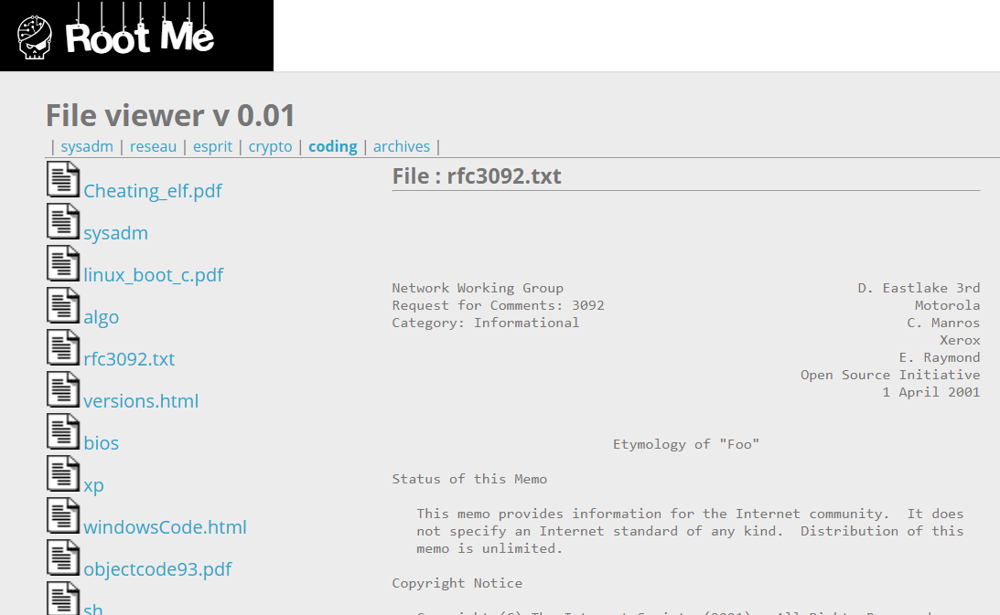

# File Upload - MIME type

**Tên challenge:**  Abbreviated LFI

**Link challenge:** [Here](https://www.root-me.org/en/Challenges/Web-Server/Local-File-Inclusion)

**Tác giả challenge:** g0uZ

**Mục tiêu challenge:** Get in the admin section.

**Tác giả Writeup:** Shino

---

# Bài giải

**B1:** Đầu tiên, ta sẽ thấy có các mục khi truy cập vào trang web như sau:
	


Sau khi thử click từng mục thì ta thấy rằng, các mục chứa các file/ thư mục trong các mục này và ta có thể click trực tiếp vào các file trong từng mục.

**VD:** Khi ta click vào file `rfc3092.txt`



Khi ta click vào các mục trên trang Web thì URL sẽ có dạng sau:
```
http://challenge01.root-me.org/web-serveur/ch16/?files=crypto
```

Nhìn vào parameter `galerie`, ta có thể liên tưởng đến các kịch bản lỗi bảo mật liên quan như Path Traversal, Local File Inclusion,...

**B2:** Ta thử payload `../../../../../../../../../../../etc/passwd`, để xem Website có trả về nội dung file `passwd` không

Tuy nhiên, trang Web chỉ trả về dòng lỗi sau:
```
Warning: realpath(): open_basedir restriction in effect. File(/etc/passwd) is not within the allowed path(s): (/challenge/web-serveur/ch16:/tmp) in /challenge/web-serveur/ch16/index.php on line 33
```
**Giải thích:** Cảnh báo này ngăn không cho phép truy cập tệp ngoài phạm vi đã cấu hình. `open_basedir` ở đây là một cơ chế bảo mật, giúp giới hạn truy cập tệp và thư mục, ngăn chặn các tấn công kiểu `Path Traversal`, `Local File Inclusion`,...

Tuy nhiên, khi ta nhìn thử vào đoạn lỗi thì ta phát hiện đường dẫn chính xác chứa file `index.php` ( File mà ta đang tương tác ) là `/challenge/web-serveur/ch16/index.php`.

Vì ta có thể click file trực tiếp trên trang Web và parameter `files` chỉ nhận giá trị là đường dẫn đến thư mục, nên ta chỉ cần chọn đến `/challenge/web-serveur/ch16` để tìm thư mục `admin`.

**B3:** Tiếp tục đổi payload thành `../../../../../../../../../../../challenge/web-serveur/ch16/`

Kết quả là trang Web trả về kết quả các file và thư mục trong `/ch16`:


**B4:** Ta tiếp tục thêm thư mục `admin` vào cuối payload `../../../../../../../../../../../challenge/web-serveur/ch15/` để xem trong thư mục `admin` có file `password.txt` không


Ta thu được: 1 file `index.php`

**B5:** Ta thử click vào file `index.php` để xem thử nội dung.


Từ ảnh trên, ta biết được `password` là: `OpbNJ60xYpvAQU8`