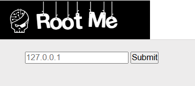
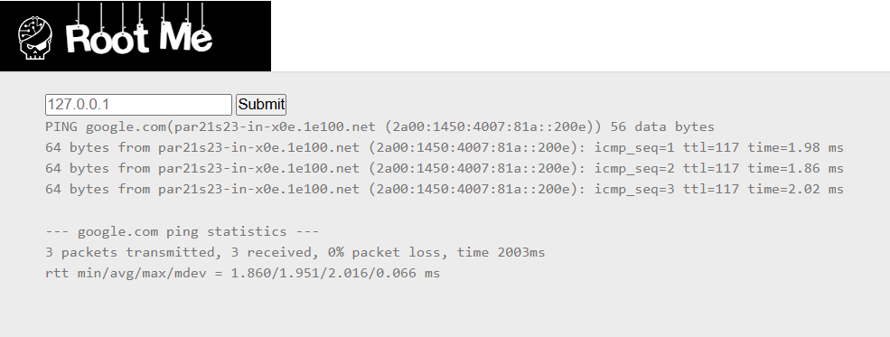
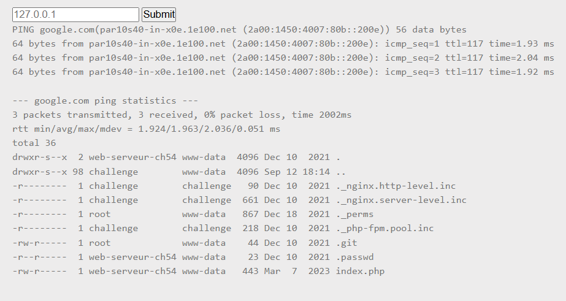

# File Upload - MIME type

**Tác giả challenge:** sambecks

**Link challenge:** [Here](https://www.root-me.org/en/Challenges/Web-Server/PHP-Command-injection)

**Mục tiêu challenge:**
Find a vulnerabilty in this service and exploit it. You must manage to read index.php

**Tác giả Writeup:** Shino

---

# Bài giải

**B1:** Đầu tiên, giao diện Website chỉ có 1 chức năng Ping duy nhất:

**B2:** Ta thử điền google.com vào thì Website trả về kết quả như sau:

Đến đây thì ta có thể hình dung Website sẽ lấy input ta nhập vào rồi thực hiện cú pháp ping đến input đó.

**VD:** ping input_nguoidung

`Lúc này, câu hỏi đặt ra là: "Liệu Website có xử lý đúng cách input của người dùng không ? Và liệu ta có thể lợi dụng chức năng này để kéo dài câu lệnh và khiến cho hệ thống thực thi Command theo ý mình không ?"`

**B3:** Để tìm ra câu trả lời thì ta sẽ thử payload input như sau: `google.com; ls -la`

* <u>**Giải thích:**</u> google.com là để kết hợp với lệnh ping của hệ thống, sau đó ta sẽ thêm `; ls -la` để thử xem liệu Website có thực thi câu lệnh được kéo dài này của ta không ?
* Nếu như giả thuyết của ta đúng thì cú pháp của hệ thống lúc này sẽ như sau: `ping google.com; ls -la`

=> Kết quả ở trên khác với kết quả của input `google`, và ta cũng thấy là Website trả về kết quả câu lệnh `ls -la` do ta kéo dài.

=> Từ đây, ta có thể kết luận trang web đã không filter kỹ input từ người dùng, dẫn đến hậu quả là lổ hổng Command Injection.
