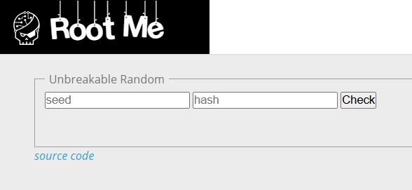
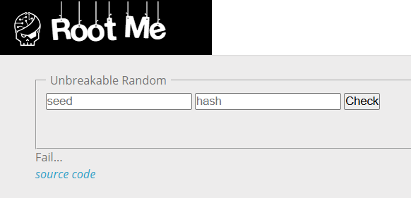
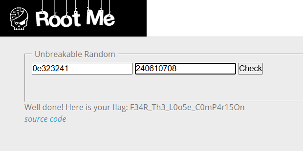

# PHP - Loose Comparison

**Tên challenge:** Another PHP Type Juggling

**Link challenge:** [Here](https://www.root-me.org/en/Challenges/Web-Server/PHP-Loose-Comparison)

**Tác giả challenge:** ghozt

**Mục tiêu challenge:** Find a way to get the flag. No bruteforce needed.

**Tác giả Writeup:** Shino

---

# Bài giải

**B1:** Đầu tiên, giao diện Website khá đơn giản, chỉ có 1 chức năng Check điều gì đó với 2 trường input:



**B2:** Ta thử fill 2 trường input lần lượt là `seed` và `hash` vào thì Website trả về kết quả như sau:



Nếu để ý thì ta sẽ có 1 dòng chữ `source code` ở phía dưới, khi thử click vào thì trang web trả về source code của web.

Sau khi đọc kỹ phần source code thì ta sẽ biết được rằng, để trang web trả `flag` thì ta phải làm cho đoạn so sánh `if($s.$r == $h)` trả về kết quả true trong đoạn code dưới đây:

```
if (isset($_POST['s']) && isset($_POST['h'])) {
    $s = sanitize_user_input($_POST['s']);
    $h = secured_hash_function($_POST['h']);
    $r = gen_secured_random();
    if($s != false && $h != false) {
        if($s.$r == $h) {
            print "Well done! Here is your flag: ".$flag;
        }
        else {
            print "Fail...";
        }
    }
    else {
        print "<p>Hum ...</p>";
    }
}
```
**Giải thích đoạn code:**
* **$s** chính là trường input đầu tiên đã được filter bởi hàm `sanitize_user_input()`
* **$h** chính là giá trị hash bằng thuật toán MD5 của trường input thứ hai thông qua hàm `secured_hash_function()`
* **$r** là biến sẽ được mang giá trị số random do hàm `gen_secured_random()` xử lý ( Bạn có thể đọc full source code để thấy được hàm này )
* Nếu cả 2 trường input `$s` và `$h` đều có giá trị thì nó sẽ thoả mãn điều kiện `if($s != false && $h != false)` và thực thi tiếp câu lệnh bên trong.

` Câu hỏi đặt ra lúc này là: "Liệu làm sao để ta bybass được if($s.$r == $h) ? Vì để 1 giá trị $s nhân với 1 số ngẫu nhiên bằng với giá trị hash $h thì như mò kim đáy bể"`

Nhưng PHP lại có 1 điểm rất thú vị giúp chúng ta có thể bybass được đoạn code if trên và điểm đó chính là PHP khi so sánh 1 string có dạng `0e13213131` với số `0` có kiểu dữ liệu số thì nó sẽ trả về kết quả là 2 thằng bằng nhau.

Thật kỳ lạ đúng không ? Vì PHP sẽ xem 1 chuỗi string bắt đầu bằng `0e` và sau nó toàn là chữ số thì PHP sẽ hiểu là đây là 0 mũ ...

**VD:** 0e12345 thì PHP sẽ hiểu là 0^12345

Cho nên, ta có thể lợi dụng điểm này để vế trái và vế phải của `if($s.$r == $h)` đều bằng 0 thì ta sẽ vượt qua được kiểm tra.

**B3:** Ta nhập trường input đầu tiên là `0e323241`

Tới đây thì ta đã làm cho vế trái bằng 0 vì `$s = 0e323241 = 0` và `$r` lại là 1 số random, mà số nào nhân với 0 thì cũng bằng 0

=> Vế `$s.$r = 0`

Tiếp theo, ta cần làm cho vế phải cũng bằng 0 và để làm được thì ta phải làm cho vế phải cũng có dạng `0e`. 

**B4:** Tra cứu xem chuỗi nào khi vào hàm băm MD5 sẽ có dạng `0e` thì ta thu được chuỗi `240610708`



=> Ta đã thành công vượt qua được điều kiện so sánh lỏng lẻo của Webiste và thành công lấy được flag.

