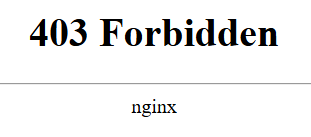

# PHP - Path Truncation

**Tên challenge:** PHP limits

**Link challenge:** [Here](https://www.root-me.org/en/Challenges/Web-Server/PHP-Path-Truncation)

**Tác giả challenge:** Geluchat

**Mục tiêu challenge:** Retrieve an access to the administration’s zone.

**Tác giả Writeup:** Shino

---

# Bài giải

**B1:** Đầu tiên, giao diện Website khá đơn giản, chỉ có 2 chữ có thể Click như sau:


**B2:** Ta thử click lần lượt vào `Home` và `Administrator`:

1. Home:


Ngoài ra, URL của Website cũng xuất hiện 1 parameter `page=home`
```
http://challenge01.root-me.org/web-serveur/ch35/index.php?page=home
```
2. Administrator:



Ngoài ra, khi xem URL sau khi click vào `Administrator`, ta phát hiện nó sẽ chuyển hướng ta sang endpoint `admin.html`.

Nhìn lại parameter `page` khi ta click vào `Home` ở trên, có thể bị lỗ hổng LFI.

**B3:** Ta tiến hành đổi giá trị parameter `page` thành `admin.html`

=> Kết quả là chẳng có gì xảy ra.

Tương tự khi ta thử payload `../../../../../../../etc/passwd` cũng không có gì trả về.

Tới đây, ta có thể phỏng đoán dòng code xử lý của trang Web parameter `page` khi ta click vào `Home` đơn giản như sau:
```php
if(isset($_GET['page']) 
{     
    include($_GET['page'].".php");
}
```
**VD:** Ở trường hợp khi parameter `page=home` thì dòng code `include` có dạng hoàn chỉnh sau:
```php
include("home.php");
```
Do đó khi ta nhập `admin.html` thì dòng `include` sẽ thành:
```php
include("admin.html.php");
```
Từ đó, không trả về kết quả vì trên Server không tồn tại file nào có tên `admin.html.php`.

Và mục tiêu của Challenge này là ta đọc nội dung file `admin.html`.

Thông thường, phương pháp thêm `NULL Byte` (`%00`) vào cuối input như `admin.html%00` để loại bỏ đuôi `.php` có thể có tác dụng nhưng đối với Challenge này thì sẽ bị:
```
Attack Detected
```
 
Câu hỏi được đặt ra ở đây là: Làm sao mới có thể vào được file `admin.html` thông qua việc loại bỏ đuôi `.php` trong code ?

* **Trả lời:** Trong PHP, chiều dài tối đa `MAX_LENGTH` của 1 string là 4096 ký tự. Do đó, nếu ta có thể tận dụng điểm này và thêm vào những ký tự với mục đích làm cho đuôi `.php` trong code bị đẩy ra khỏi giới hạn 4096 ký tự cho phép của chuỗi string thì ta có thể loại bỏ được nó.

Như ta đã biết trong Linux thì dấu `..` và dấu `.` là 2 thư mục đặc biệt.
* `.` tượng trưng cho thư mục hiện tại
* `..` lùi về thư mục trước đó.

**VD:**
```
$> cat /etc/passwd
root:x:0:0:root:/root:/bin/bash

$> cat /etc/././passwd/././././.
root:x:0:0:root:/root:/bin/bash
```
=> Cả 2 cách trên đều ra cùng kết quả.

=> Từ đó, ta có thể dùng `./` để làm các ký tự chèn thêm sao cho payload vượt quá 4096 ký tự thì đuôi `.php` trong code sẽ tự động bị loại bỏ.

**B4:** Khai thác theo cách trên thông qua tạo payload bằng Python.
```
$> python -c "print 'o/../../../../../../challenge/web-serveur/ch35/admin.html/'+'./'*2100"
```
<u>**Lưu ý:**</u> Payload bắt buộc 1 thư mục bất kỳ phải nằm ở đầu tiên ( thư mục tồn tại hay không tồn tại đều được ) vì ta không thể nào để tên 1 file ở đầu được vì theo Logic của Linux, ta không thể nào dùng lệnh `cd` như sau:
```
$> cd /test/../ok.html 

$> cd /ok.html/../
```
Câu lệnh đầu tiên, đúng vì `cd` đến `test` là thư mục, còn lệnh thứ 2 sai vì không thể `cd` đến file và sau đó lại dùng `..`, như vậy sẽ xảy ra lỗi.

Tiếp đến, chỉ cần copy payload và gửi vào parameter `page` là sẽ truy cập được file `admin.html`.