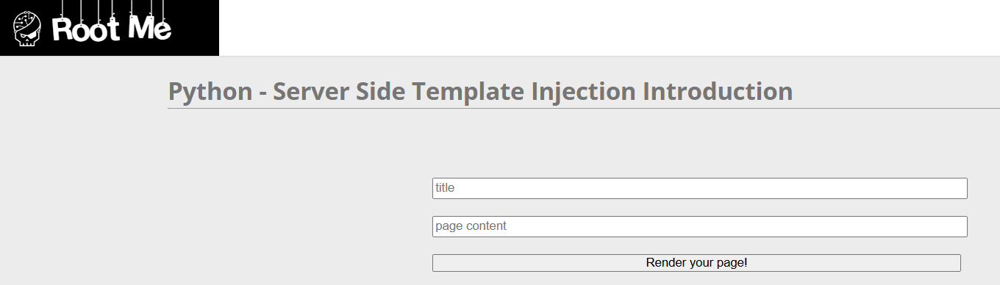
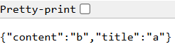
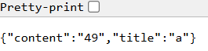
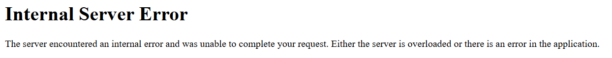
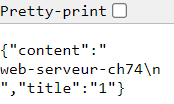

# Python - SSTI Introduction

**Tên challenge:** Python - SSTI Introduction

**Link challenge:** [Here](https://www.root-me.org/en/Challenges/Web-Server/Python-Server-side-Template-Injection-Introduction)

**Tác giả challenge:** Podalirius

**Mục tiêu challenge:** This service allows you to generate a web page. Use it to read the flag!

**Tác giả Writeup:** Shino

---

# Bài giải

**B1:** Đầu tiên, giao diện Website khá đơn giản, chỉ có 1 chức năng Render trang Web với 2 trường input:



**B2:** Ta thử nhập 2 giá trị cho `title` và `page content` lần lượt là `a` và `b`

Trang Web chuyển hướng ta sang 1 trang mới



Thông thường thì các lỗi bảo mật liên quan Render trang Web đến parameter rất nhiều ( Chẳng hạn như: XSS, SSTI,... ), cho nên ta sẽ thử từng trường hợp.

**B3:** Thử từng payload và ở cả 2 trường input. Cho đến khi ta thử đến payload `{{7*7}}` ở trường input `page content` thì trang Web trả về kết quả như sau:



=> Ta có thể tạm thời kết luận là trang Web bị SSTI nhưng liệu ta có thể RCE thông qua loại lỗi này không thì vẫn chưa thể kết luận. Vì rất có thể Website chỉ cho phép những câu thử đơn giản và filter những payload liên quan đến RCE, và để củng cố thêm kết luận này ta sẽ thử đến payload có thể giúp ta thực thi command.

**B4:** Thử payload RCE `{{request.application.__globals__.__builtins__.__import__('os').popen('whoami').read()}}`



=> Vậy là kết quả đã kết luận rằng Website có sử dụng WAF để ngăn chặn việc khai thác SSTI.

**B5:** Ta tiếp tục thử từng payload liên quan đến SSTI nhằm Bypass được cơ chế WAF của Website.

Cuối cùng, ta tìm được payload có thể thực thi Command như sau:
```
              {{x()._module.__builtins__['__import__']('os').popen("whoami").read()}}      
```



=> Ta đã thành công thực thi Command, việc tiếp theo là ta đọc file Flag thôi.

<u><b>Thông tin thêm:</b></u> Flag nằm ở thư mục hiện tại và nằm ở file `.passwd`