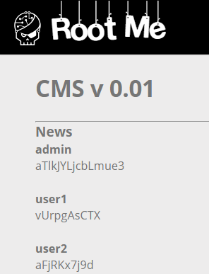

# SQL Injection - Numeric

**Tên challenge:** CMS v 0.0.1

**Link challenge:** [Here](https://www.root-me.org/en/Challenges/Web-Server/SQL-injection-Numeric)

**Tác giả challenge:** g0uZ

**Mục tiêu challenge:** Retrieve the administrator password.

**Tác giả Writeup:** Shino

---

# Bài giải

**B1:** Đầu tiên, giao diện Website khá đơn giản, chỉ có vài chức năng như sau:
1. Trang `Accueil` có chức năng đưa ra các thông tin `news` và ta có thể click vào từng tin để đọc nội dung:


2. Chức năng `Login` dùng để đăng nhập:


**B2:** Như thường lệ, ta sẽ thử SQL Injection ở chức năng Login nhưng không thành công, cho nên ta sẽ thử payload ở chức năng có khả năng nhất là `Accueil`:

Khi ta Click vào 1 trong các dòng `news` ở trang `Accueil` thì URL Website sẽ có dạng sau:
```
http://challenge01.root-me.org/web-serveur/ch18/?action=news&news_id=1
```

Ta thử chèn payload SQL Injection `1 or 1=1 --` vào parameter `news_id` để xem Website có hoạt động bình thường không:


=> Vậy là parameter này bị SQL Injection

**B3:** Ta thử tới payload lấy `password` của `admin`:
```
-1 union select password from users --
```


Lỗi trên là do sự không tương đồng cột của hai cấu truy vấn trước và sau UNION, cho nên ta sẽ sửa lại payload thành như sau:
```
-1 union select null, username, password from users --
```



=> Ta đã thành công lấy được `password` của `admin`.
