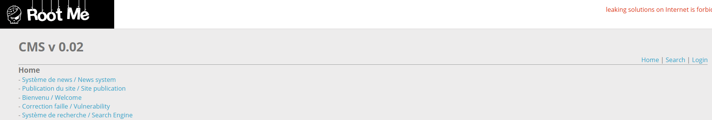
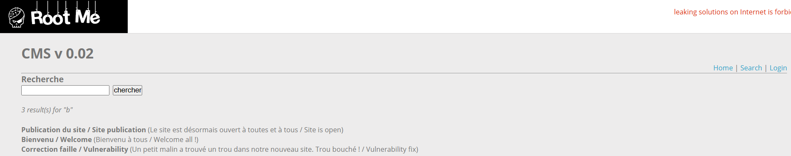
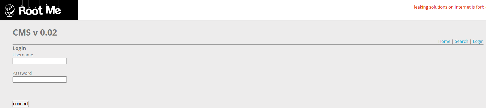
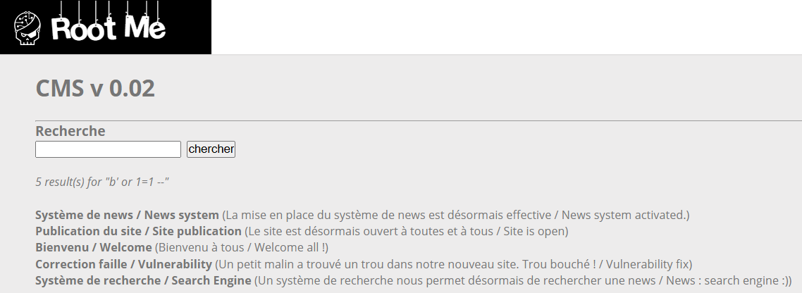
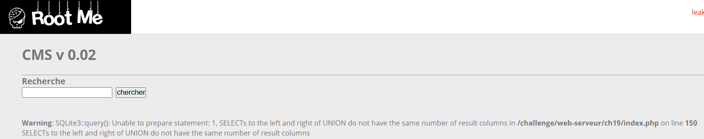
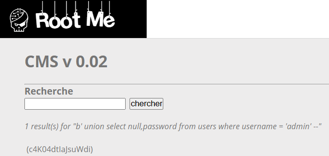

# SQL Injection - String

**Tên challenge:** CMS v 0.0.2

**Link challenge:** [Here](https://www.root-me.org/en/Challenges/Web-Server/SQL-injection-String)

**Tác giả challenge:** g0uZ

**Mục tiêu challenge:** Retrieve the administrator password.

**Tác giả Writeup:** Shino

---

# Bài giải

**B1:** Đầu tiên, giao diện Website khá đơn giản, chỉ có vài chức năng như sau:
1. Trang `Home` có chức năng đưa ra các thông tin `news` và ta có thể click vào từng tin để đọc nội dung:



2. Chức năng `Search` giúp ta tìm kiếm từ khoá về các bài `news` hoặc nội dung của `news`:



3. Chức năng `Login` dùng để đăng nhập:



**B2:** Như thường lệ, ta sẽ thử SQL Injection ở chức năng Login nhưng không thành công, cho nên ta sẽ thử payload ở chức năng có khả năng nhất là `Search`:

Khi ta nhập chữ `b` thì trang Web sẽ trả về kết quả như sau:


Ta thử chèn payload SQL Injection `b' or 1=1 --` để xem Website có hoạt động bình thường không:



=> Vậy là chức năng này bị SQL Injection

**B3:** Ta thử tới payload lấy `password` của `admin`:
```
b' union select password from users where username = 'admin' --
```



Lỗi trên là do sự không tương đồng cột của hai cấu truy vấn trước và sau UNION, cho nên ta sẽ sửa lại payload thành như sau:
```
b' union select null, password from users where username = 'admin' --
```


=> Ta đã thành công lấy được `password` của `admin`.
