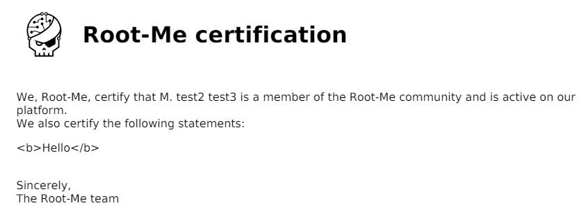

# XSS - Server Side

**Tên challenge:**  Who said XSS was only for the client side?

**Link challenge:** [Here](https://www.root-me.org/en/Challenges/Web-Server/XSS-Server-Side)

**Tác giả challenge:** Elf

**Mục tiêu challenge:**
This platform for issuing certificates of participation has just gone live. The developers assure you that they have followed best practices and escaped all user inputs before using them in their code... The flag is located in the `/flag.txt` file.

**Tác giả Writeup:** Shino

---

# Bài giải

**B1:** Đầu tiên, ta sẽ thấy trang Web có 1 chức năng chính là `Generate` và 2 chức năng phụ `Sign Up` và `Log In`.
	


**B2:** Ta thử nhập `hello` vào khung ở giữa rồi Click vào nút `Generate`


Sau khi Click nút `Generate` thì 1 file PDF có tên `attestation.pdf` được tải xuống và có nội dung như sau:


Ta thấy nội dung `hello` của ta xuất hiện trong file `pdf`.

**B3:** Ta thử `Sign Up` và `Log In` với nội dung như sau:


**B4:** Sau khi đăng nhập với username `test1` và password `1` vừa tạo, ta thử nhập lại nội dung ở khung giữa là `<b>Hello</b>` rồi `Generate`.

File `pdf` được tải xuống có nội dung như sau:



=> Từ ảnh trên, ta có thể thấy First name `test2` và Last name `test3` xuất hiện ở dòng dầu tiên của file `pdf`.

Ngoài ra, có vẻ như khung chức năng ở giữa trang không thể giúp ta chèn nội dung `XSS` dù cho ta đã thử nhiều payload khác nhau.

Nhưng nếu để ý thì First name và Last name cũng có thể có nguy cơ bị XSS nên ta có thể kiểm chức giả thuyết này bằng payload `<b>First_Name</b>` và `<b>Last_Name</b>`

**B5:** Ta thử `Sign Up` 1 tài khoản mới với nội dung sau:


**B6:** Ta đăng nhập với tài khoản mới và nhập nội dung bất kỳ rồi `Generate`.

File `pdf` mới được tải xuống có kết quả đáng mong đợi:


=> Từ kết quả trên, ta có thể kết luận `First_name` và `Last_name` có tiềm năng cao bị **XSS**.

Do file `pdf` không thể hiển thị các payload XSS liên quan đến `alert`, mà mục tiêu của ta chỉ là đọc file `/flag.txt`. Vì vậy, ta chỉ cần dùng tag `<iframe>` để giúp ta làm việc này.

**B7:** Ta thử đăng ký `First_name` với payload đọc file `flag.txt` như sau:
```
<iframe src ="file:///flag.txt" height="150" width="350"></iframe>
```


**B8:** Đăng nhập lại và `Generate file` `pdf`.

Và đây là nội dung file `pdf` sau khi `Generate`:


=> Ta đã thành công thực hiện được `XSS` ở phía Server.